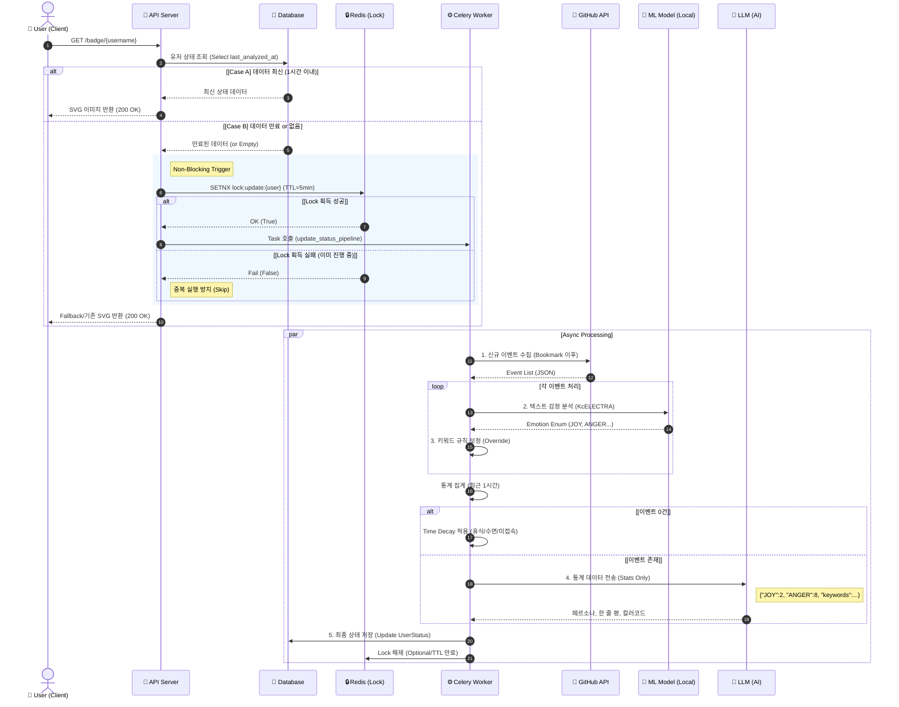

```mermaid
sequenceDiagram
    autonumber
    actor User as 👤 User (Client)
    participant API as 🚀 API Server
    participant DB as 💾 Database
    participant Redis as 🔒 Redis (Lock)
    participant Worker as ⚙️ Celery Worker
    participant GitHub as 🐙 GitHub API
    participant ML as 🤖 ML Model (Local)
    participant LLM as 🧠 LLM (AI)

    %% [Phase 1] 배지 조회 및 서빙
    User->>API: GET /badge/{username}
    API->>DB: 유저 상태 조회 (Select last_analyzed_at)
    
    alt [Case A] 데이터 최신 (1시간 이내)
        DB-->>API: 최신 상태 데이터
        API-->>User: SVG 이미지 반환 (200 OK)
    else [Case B] 데이터 만료 or 없음
        DB-->>API: 만료된 데이터 (or Empty)
        
        rect rgb(240, 248, 255)
            note right of API: Non-Blocking Trigger
            API->>Redis: SETNX lock:update:{user} (TTL=5min)
            
            alt [Lock 획득 성공]
                Redis-->>API: OK (True)
                API->>Worker: Task 호출 (update_status_pipeline)
            else [Lock 획득 실패 (이미 진행 중)]
                Redis-->>API: Fail (False)
                note right of API: 중복 실행 방지 (Skip)
            end
        end
        
        API-->>User: Fallback/기존 SVG 반환 (200 OK)
    end

    %% [Phase 2] 백그라운드 파이프라인 (Task Chain)
    par Async Processing
        Worker->>GitHub: 1. 신규 이벤트 수집 (Bookmark 이후)
        GitHub-->>Worker: Event List (JSON)
        
        loop 각 이벤트 처리
            Worker->>ML: 2. 텍스트 감정 분석 (KcELECTRA)
            ML-->>Worker: Emotion Enum (JOY, ANGER...)
            Worker->>Worker: 3. 키워드 규칙 보정 (Override)
        end
        
        Worker->>Worker: 통계 집계 (최근 1시간)

        alt [이벤트 0건]
            Worker->>Worker: Time Decay 적용 (휴식/수면/미접속)
        else [이벤트 존재]
            Worker->>LLM: 4. 통계 데이터 전송 (Stats Only)
            note right of LLM: {"JOY":2, "ANGER":8, "keywords":...}
            LLM-->>Worker: 페르소나, 한 줄 평, 컬러코드
        end

        Worker->>DB: 5. 최종 상태 저장 (Update UserStatus)
        Worker->>Redis: Lock 해제 (Optional/TTL 만료)
    end
```