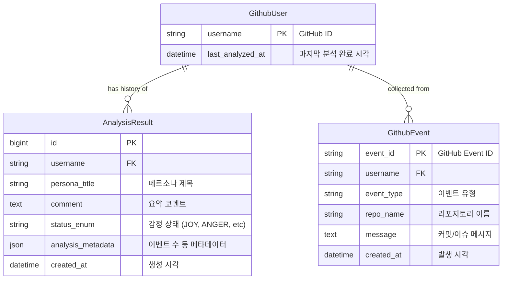

# 데이터 모델

## ER 다이어그램 (논리적)

## 엔티티 상세

### 1. GithubUser

GitHub 사용자 정보를 관리하고, 현재 분석 상태를 추적하여 중복 요청을 제어합니다.

| 필드명                | 타입             | 제약조건          | 설명                                     |
|--------------------|----------------|---------------|----------------------------------------|
| `username`         | `VARCHAR(150)` | PK, Unique    | GitHub 사용자 ID (소문자 정규화 권장)             |
| `last_analyzed_at` | `DATETIME`     | Nullable      | 가장 최근 분석이 완료된 시각. Cache 만료(1시간) 판단 기준. |
| `created_at`       | `DATETIME`     | Auto Now      | 최초 생성 시각                               |
| `updated_at`       | `DATETIME`     | Auto Now Add  | 마지막 정보 갱신 시각                           |

### 2. GithubEvent

GitHub API로부터 수집된 원본 이벤트 데이터를 저장합니다. 분석 시 재사용되며 증분 수집의 기준이 됩니다.

| 필드명          | 타입               | 제약조건              | 설명                       |
|--------------|------------------|-------------------|--------------------------|
| `event_id`   | `VARCHAR(50)`    | PK, Unique        | GitHub에서 부여한 고유 이벤트 ID   |
| `user`       | `FK(GithubUser)` | On Delete Cascade | 이벤트 발생 사용자               |
| `event_type` | `VARCHAR(100)`   | Not Null          | PushEvent, IssuesEvent 등 |
| `repo_name`  | `VARCHAR(255)`   | Not Null          | 저장소 이름 (user/repo)       |
| `message`    | `TEXT`           | Not Null          | 분석 대상 텍스트 (커밋 메시지 등)     |
| `created_at` | `DATETIME`       | Not Null          | 이벤트 실제 발생 시각 (GitHub 시간) |

### 3. AnalysisResult

분석 완료된 결과를 이력으로 저장합니다. 가장 최신 레코드가 현재 카드로 사용됩니다.

| 필드명                 | 타입               | 제약조건              | 설명                                                             |
|---------------------|------------------|-------------------|----------------------------------------------------------------|
| `id`                | `BIGINT`         | PK, Auto Inc      | 고유 ID                                                          |
| `user`              | `FK(GithubUser)` | On Delete Cascade | 분석 대상 사용자                                                      |[config](../../.git/config)
| `persona_title`     | `VARCHAR(100)`   | Not Null          | LLM이 생성한 페르소나 (예: "침착한 코드 흐름")                                 |
| `comment`           | `TEXT`           | Not Null          | LLM이 생성한 한 줄 요약                                                |
| `status_enum`       | `VARCHAR(20)`    | Not Null          | 감정 상태 (JOY, ANGER, ANXIETY, SADNESS, CONFUSION, NEUTRAL, IDLE) |
| `reason`            | `TEXT`           | Nullable          | (Optional) LLM이 분석한 근거                                         |
| `analysis_metadata` | `JSON`           | Default dict      | 사용된 모델, 분석된 이벤트 수, 신규 수집 수 등                                   |
| `created_at`        | `DATETIME`       | Auto Now          | 결과 생성 시각                                                       |

## 데이터 수명 주기 및 캐싱 전략

1. **조회 (Read)**:
    - `GithubUser` 조회 → `last_analyzed_at` 확인.
    - **Fresh (< 1h)**: 최신 `AnalysisResult` 반환.
    - **Stale (> 1h)**: 최신 `AnalysisResult` 반환 + Celery 작업 트리거 (Redis Lock 체크).
    - **Cold (None)**: "Analyzing" 플레이스홀더 반환 + Celery 작업 트리거 (Redis Lock 체크).

2. **쓰기 (Write - Worker)**:
    - GitHub API 이벤트 수집.
    - `GithubEvent` 테이블 조회하여 중복 확인 -> 신규 이벤트만 Insert (증분 수집).
    - DB에서 최근 24시간 이내의 `GithubEvent` 조회.
    - Gemini 분석 수행.
    - `AnalysisResult` Insert.
    - `GithubUser` Update (`last_analyzed_at=Now`).
