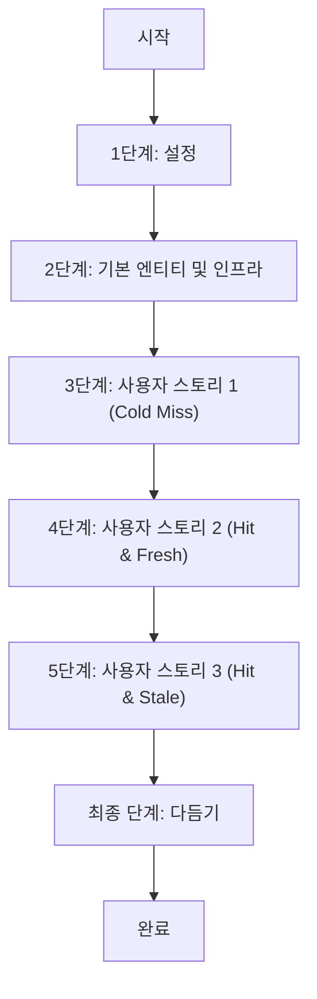

# 구현 작업: 감정 카드 생성 (Generate Emotion Card)

**브랜치**: `001-generate-emotion-card` | **날짜**: 2026-01-21 | **사양**: [spec.md](spec.md)
**입력**: `/specs/001-generate-emotion-card`의 설계 문서

## 종속성 그래프

## 구현 전략

- **MVP 우선**: 핵심 기능인 "분석 요청 → SVG 반환"을 우선 구현합니다.
- **점진적 전달**:
    - `GithubUser` 모델 및 기본 뷰 (플레이스홀더) 먼저 구현 (US1).
    - Celery 작업 및 LLM 분석 로직 통합 (US1 백그라운드).
    - 분석 완료 결과 조회 및 실제 카드 렌더링 (US2).
    - 캐싱 전략 및 만료 데이터 갱신 (US3).
- **테스트 주도**: 각 단계마다 핵심 로직에 대한 테스트를 먼저 작성하거나 병행합니다.

## 1단계: 설정 (Setup)

**목표**: 새로운 Django 앱(`card`)을 초기화하고 프로젝트 설정을 구성합니다.

- [ ] T001 [Setup] `backend/card` 앱 생성 및 `INSTALLED_APPS` 등록
- [ ] T002 [Setup] `backend/card/urls.py` 생성 및 프로젝트 `config/urls.py`에 연결
- [ ] T003 [Setup] Celery 및 Redis 설정 확인 (`backend/config/settings.py` 및 `celery.py` 점검)

## 2단계: 기본 엔티티 및 인프라 (Foundations)

**목표**: 데이터 모델을 구현하고 DB 마이그레이션을 수행합니다.

- [ ] T004 [Base] `backend/card/models.py`에 `GithubUser` 모델 구현
- [ ] T005 [Base] `backend/card/models.py`에 `AnalysisResult` 모델 구현
- [ ] T006 [Base] `backend/card/admin.py`에 모델 등록
- [ ] T007 [Base] 데이터베이스 마이그레이션 생성 및 적용 (`makemigrations`, `migrate`)

## 3단계: 사용자 스토리 1 - 최초 사용자 카드 조회 (Cold Miss)

**목표**: 데이터가 없는 사용자가 요청 시 "분석 중" SVG를 반환하고, 백그라운드 분석 작업을 트리거합니다.

**독립적 테스트**:

- `GET /card.svg?username=newuser` 요청 시 200 OK 및 Placeholder SVG 반환 확인.
- Celery 큐에 작업이 등록되었는지 확인 (Mocking).

- [ ] T008 [US1] `backend/card/templates/card/placeholder.svg` 생성 (분석 중 이미지)
- [ ] T009 [US1] `backend/card/views.py`에 `CardView` 기본 로직 구현 (User 조회 및 생성)
- [ ] T010 [US1] `backend/card/tasks.py`에 `analyze_user_task` 스켈레톤 구현 (로깅만 수행)
- [ ] T011 [US1] `CardView`에서 Cold Miss 시 `analyze_user_task` 호출 및 Placeholder 렌더링 로직 연결
- [ ] T012 [P] [US1] `backend/card/services.py`에 `GitHubClient` 구현 (Playground 코드 이관 및 리팩토링)
- [ ] T013 [P] [US1] `backend/card/services.py`에 `GeminiClient` 구현 (Playground 코드 이관 및 리팩토링)
- [ ] T014 [US1] `backend/card/tasks.py`에 실제 분석 로직 구현 (GitHub 이벤트 증분 수집 및 API 장애 재시도 포함 -> Gemini 분석 -> DB 저장)

## 4단계: 사용자 스토리 2 - 분석 완료 후 카드 조회 (Hit & Fresh)

**목표**: 분석이 완료된 사용자에 대해 실제 결과가 반영된 SVG 카드를 반환합니다.

**독립적 테스트**:

- DB에 분석 결과가 있는 사용자로 요청 시, 해당 데이터가 포함된 SVG 반환 확인.

- [ ] T015 [US2] `backend/card/templates/card/card.svg` 생성 (실제 데이터 바인딩용 템플릿)
- [ ] T016 [US2] `backend/card/views.py`에 분석 완료(`AnalysisResult` 존재) 시 실제 카드 렌더링 로직 추가
- [ ] T017 [US2] `backend/card/views.py`에 `Cache-Control` 헤더 설정 적용

## 5단계: 사용자 스토리 3 - 만료된 데이터 조회 및 백그라운드 갱신 (Hit & Stale)

**목표**: 데이터가 만료(1시간 경과)된 경우, 기존 카드를 즉시 반환하고 백그라운드에서 재분석을 수행합니다.

**독립적 테스트**:

- `last_analyzed_at`이 2시간 전인 사용자로 요청 시, 즉시 응답(기존 카드) 및 Celery 작업 트리거 확인.

- [ ] T018 [US3] `backend/card/views.py`에 Stale 데이터 감지 및 재분석 트리거 로직 추가 (`Stale-While-Revalidate`)
- [ ] T019 [US3] `backend/card/tasks.py`에 중복 실행 방지 로직 보완 (Distributed Lock 활용 고려 또는 `is_analyzing` 필드 활용)

## 최종 단계: 다듬기 및 교차 관심사

**목표**: 에러 처리, 코드 정리 및 최종 점검.

- [ ] T020 [Final] `backend/card/views.py`에 예외 처리 및 Fallback SVG(에러용) 적용
- [ ] T021 [Final] `backend/card/tests.py`에 주요 시나리오(Cold, Fresh, Stale) 통합 테스트 및 응답 시간(200ms) 검증 테스트 작성
